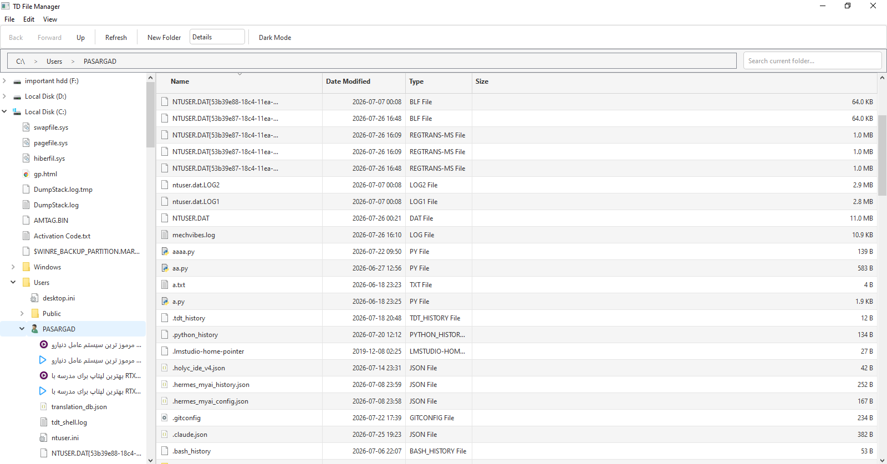
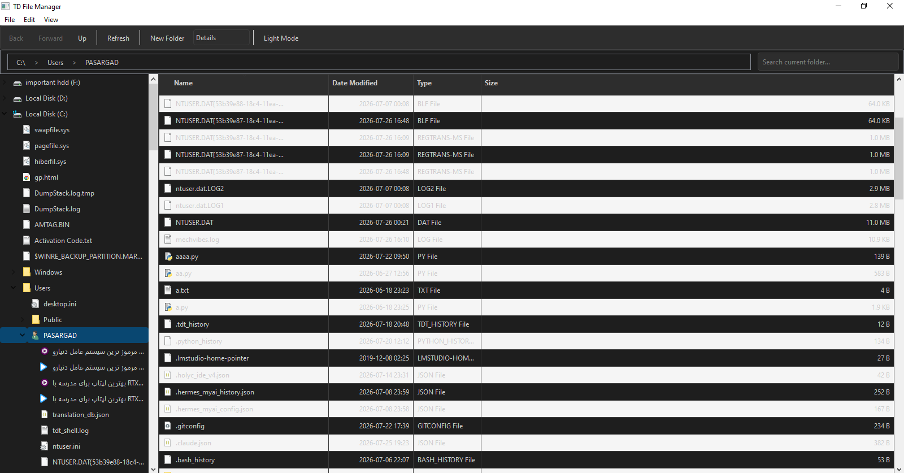
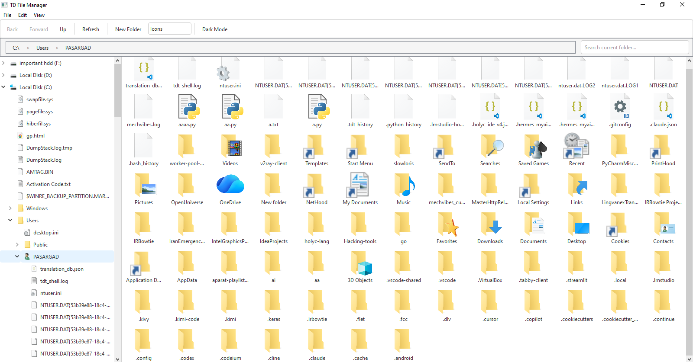
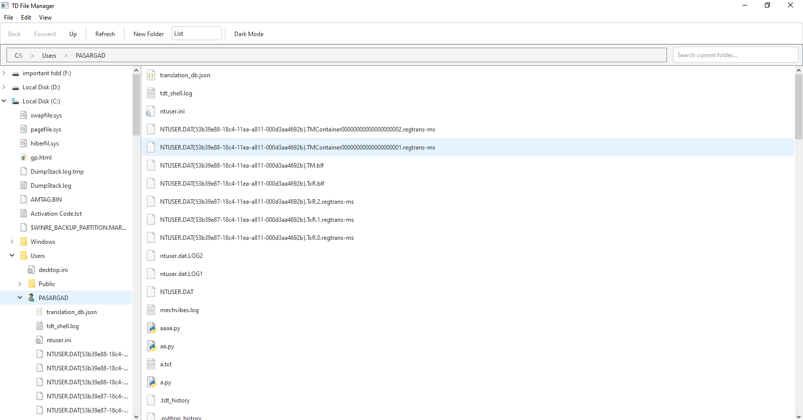
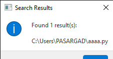
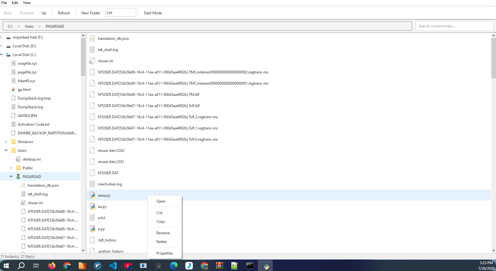
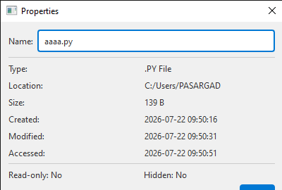
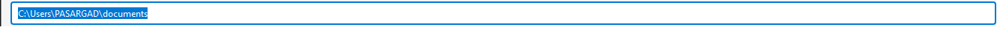

<div align="center">

<!-- Animated Header -->
[](https://github.com/Taha-Azadi/TD-File-manager)

<!-- Badges -->
<p>
  <a href="https://www.python.org/downloads/"></a>
  <a href="https://www.riverbankcomputing.com/software/pyqt/"></a>
  <a href="LICENSE"></a>
  <a href="#"></a>
</p>

<!-- Banner Image -->


<p><b>A powerful, modern file manager inspired by Windows Explorer — built with Python & PyQt6.</b></p>

<p>
  <a href="#features">Features</a> •
  <a href="#screenshots">Screenshots</a> •
  <a href="#installation">Installation</a> •
  <a href="#usage">Usage</a> •
  <a href="#keyboard-shortcuts">Shortcuts</a> •
  <a href="#tech-stack">Tech Stack</a>
</p>

</div>

---

## ✨ Features

<table>
<tr>
<td width="50%">

### 🗂️ Dual-Pane Layout
- **Left Panel**: Hierarchical tree navigation with expandable folders
- **Right Panel**: Content view with 4 different display modes
- **Resizable Splitter**: Adjust panel widths to your preference

### 🔗 Smart Address Bar
- **Breadcrumb Navigation**: Click any folder in the path to jump directly
- **Edit Mode**: Click the path to type a full directory path manually
- **Auto-Updates**: Path bar syncs automatically as you browse

### 👁️ Multiple View Modes
| Mode | Description |
|------|-------------|
| 📋 **Details** | Column view — Name, Date, Type, Size with sorting |
| 🖼️ **Icons** | Large icon grid for visual browsing |
| 📑 **List** | Compact list with small icons |
| 🟦 **Tiles** | Medium icons with file names |

</td>
<td width="50%">

### ✂️ Full File Operations
- **Cut / Copy / Paste** with clipboard persistence
- **Delete** with confirmation dialog
- **Rename** inline or via dialog (F2)
- **New Folder** creation (Ctrl+Shift+N)
- **Drag & Drop** support for importing files

### 🔍 Built-in Search
- Search within current directory recursively
- Background threaded search (no UI freeze)
- Progress dialog with cancel option
- Results displayed with full paths

### 🌗 Light & Dark Themes
- **Light Mode**: Clean, modern Windows-style white theme
- **Dark Mode**: Eye-friendly dark theme for night usage
- **One-click toggle** with persistent state
- Custom stylesheet engine for consistent styling

</td>
</tr>
</table>

---

## 📸 Screenshots

### 🖥️ Main Interface — Light Mode
<p align="center">
  
</p>
<p align="center"><i>Main window showing dual-pane layout with Details view in Light theme</i></p>

### 🌙 Main Interface — Dark Mode
<p align="center">
  
</p>
<p align="center"><i>Same view with Dark theme enabled — easy on the eyes for night sessions</i></p>

### 🖼️ Icons View
<p align="center">
  
</p>
<p align="center"><i>Large icon grid view for visual file browsing</i></p>

### 📑 List & Tiles View
<p align="center">
  
</p>
<p align="center"><i>Compact List view (left) and Tiles view (right)</i></p>

### 🔍 Search in Action
<p align="center">
  
</p>
<p align="center"><i>Real-time search with progress dialog and result listing</i></p>

### 📋 Context Menu & Properties
<p align="center">
  
  &nbsp;&nbsp;
  
</p>
<p align="center"><i>Right-click context menu (left) and File Properties dialog (right)</i></p>

### 🗂️ Breadcrumb Navigation
<p align="center">
  
</p>
<p align="center"><i>Clickable breadcrumb path bar — jump to any parent folder instantly</i></p>

---

## 🚀 Installation

### Prerequisites
- Python **3.9** or higher
- pip (Python package manager)

### Step 1: Clone the Repository
```bash
git clone https://github.com/Taha-Azadi/TD-File-manager.git
cd TD-File-manager
```

### Step 2: Install Dependencies
```bash
pip install -r requirements.txt
```

### Step 3: Run
```bash
python main.py
```

---

## 🎮 Usage

### Basic Navigation
- Click folders in the **left tree** or **right pane** to navigate
- Use **Back / Forward / Up** buttons or `Alt+Arrow` keys
- Click any part of the **breadcrumb path** to jump to that folder

### File Operations
| Action | How |
|--------|-----|
| Open file/folder | Double-click or Enter |
| New Folder | Toolbar button or `Ctrl+Shift+N` |
| Rename | `F2` or right-click → Rename |
| Delete | `Delete` key or right-click → Delete |
| Cut / Copy / Paste | `Ctrl+X/C/V` or context menu |

### Switching Views
Use the **View dropdown** in the toolbar or the **View menu**:
- **Details** — Sortable columns, best for file management
- **Icons** — Best for folders with images
- **List** — Compact, maximum items visible
- **Tiles** — Balanced icon + name display

### Themes
Click the **Dark Mode / Light Mode** button in the toolbar to toggle instantly.

---

## ⌨️ Keyboard Shortcuts

| Shortcut | Action |
|----------|--------|
| `Alt + Left` | Go Back |
| `Alt + Right` | Go Forward |
| `Alt + Up` | Go to Parent Folder |
| `F5` | Refresh |
| `Ctrl + Shift + N` | New Folder |
| `Ctrl + X` | Cut |
| `Ctrl + C` | Copy |
| `Ctrl + V` | Paste |
| `Delete` | Delete (with confirmation) |
| `F2` | Rename |
| `Ctrl + A` | Select All |

---

## 🛠 Tech Stack

<p align="center">
  
</p>

| Technology | Purpose |
|------------|---------|
| **Python 3.9+** | Core language |
| **PyQt6** | Cross-platform GUI framework |
| **QFileSystemModel** | Native file system integration & caching |
| **QThread** | Background search without blocking UI |
| **Custom Stylesheets** | Light/Dark theme engine |

---

## 📁 Project Structure

```
TD-File-manager/
├── main.py                      # Application entry point
├── requirements.txt             # Python dependencies
├── LICENSE                      # MIT License
├── README.md                    # This file
├── screenshots/                 # App screenshots
│   ├── banner.png
│   ├── light_mode_main.png
│   ├── dark_mode_main.png
│   ├── view_icons.png
│   ├── view_list_tiles.png
│   ├── search_feature.png
│   ├── context_menu.png
│   ├── properties_dialog.png
│   └── breadcrumb_bar.png
├── src/                         # Source code
│   ├── __init__.py
│   ├── main_window.py          # Main window & UI logic
│   ├── file_system_model.py    # Custom QFileSystemModel
│   ├── address_bar.py          # Breadcrumb address bar
│   ├── theme_manager.py        # Light/Dark theme engine
│   ├── search_worker.py        # Background search thread
│   ├── properties_dialog.py    # File properties dialog
│   └── navigation_bar.py       # Navigation components
└── docs/
    └── usage.md                # Extended usage documentation
```

---

## 🤝 Contributing

Contributions are welcome! Here's how to get started:

1. **Fork** the repository
2. Create a **feature branch**: `git checkout -b feature/AmazingFeature`
3. **Commit** your changes: `git commit -m 'Add some AmazingFeature'`
4. **Push** to the branch: `git push origin feature/AmazingFeature`
5. Open a **Pull Request**

### Priority Contributions
- [ ] Add **thumbnail previews** for images in Icon view
- [ ] Add **file preview pane** (text, images, PDF)
- [ ] Implement **multi-tab browsing**
- [ ] Add **bookmark/favorites** sidebar section
- [ ] Implement **file compression** (ZIP/RAR creation)
- [ ] Add **bulk rename** tool

---

## 📜 License

This project is licensed under the **MIT License** — see the [LICENSE](LICENSE) file for details.

---

<div align="center">

## 👨‍💻 Built by [Taha Azadi](https://github.com/Taha-Azadi)

<p>
  <a href="https://github.com/Taha-Azadi"></a>
  <a href="https://x.com/TahaAzadiDev"></a>
  <a href="https://www.linkedin.com/in/Taha-Azadi-Dev"></a>
  <a href="mailto:taha.azadi.dev@gmail.com"></a>
</p>

<p><i>Building practical tools with clean code. From Zanjan to the world.</i></p>

<!-- Profile views counter -->
<p>
  
</p>

</div>
